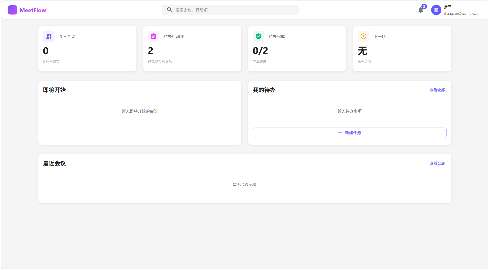
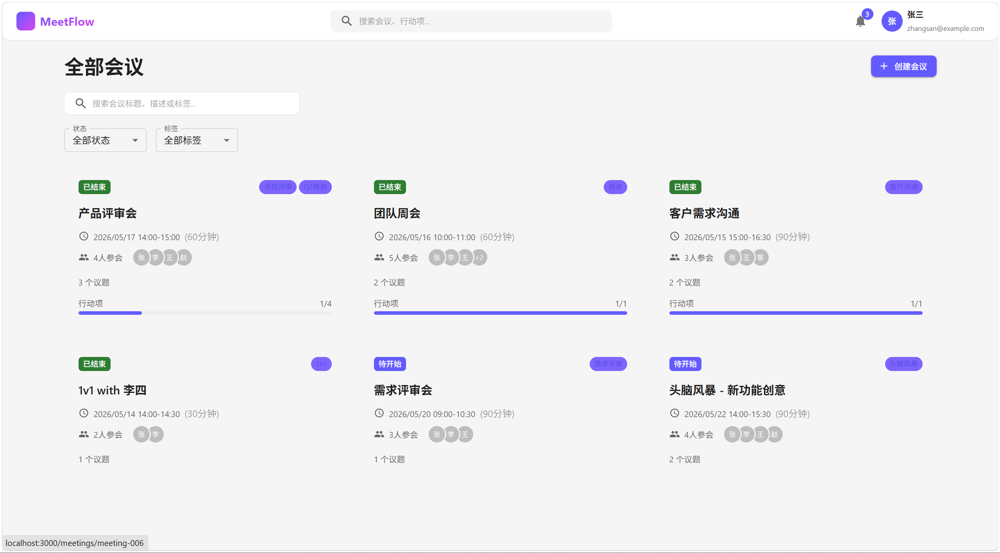
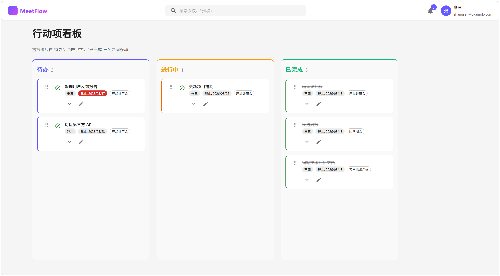

# MeetFlow - 视频会议助手

> **会议结束即纪要就绪，行动项自动归位。**

MeetFlow 是一款轻量级、平台无关的网页端会议助手，聚焦于**会前准备**和**会后跟进**两个环节，帮助用户解决会议信息分散、纪要整理耗时、待办事项遗漏三大核心痛点。

---

## 与竞品的差异化优势

通过对飞书妙记、钉钉 AI 会议、腾讯会议 AI、Otter.ai、Fireflies.ai、tl;dv、Granola、Fathom 等 8 款主流产品的调研分析，MeetFlow 在以下四个方面形成明确差异化：

### 1. 会前准备完整闭环 — 竞品普遍缺失

大多数会议助手聚焦于"会中记录"和"会后整理"，会前管理几乎无人覆盖。MeetFlow 提供 **议题收集 → 议程生成 → 模板套用** 的完整会前流：

- **议题管理**：支持添加、编辑、删除议题，为每个议题指定负责人和预估时长
- **拖拽排序**：议题支持拖拽调整顺序（基于 @dnd-kit）
- **会议模板**：提供周会、项目评审、客户沟通、1v1 等预设模板，**一键套用**自动预填标题、描述、标签和预设议程

> 对比：飞书妙记需手动关联日程，操作步骤多；Otter / Fireflies 无会前管理能力

### 2. 待办驱动的会后跟进 — 竞品止步于静态纪要

绝大多数竞品的终点是"生成一份纪要文档"，MeetFlow 的核心锚点是**行动项追踪**——会议结束即生成纪要，纪要中的行动项自动进入可追踪的看板：

- **AI 纪要生成**：一键生成结构化纪要（摘要 + 关键决策 + 争议点 + 发言统计）
- **行动项看板**：三列看板（待办 / 进行中 / 已完成），支持拖拽卡片在列间流转
- **卡片详情**：每张行动项卡片展示负责人、截止日期、来源会议，支持编辑备注

> 对比：飞书妙记、Otter 等生成的纪要是静态文档，缺乏执行跟进机制

### 3. 全维度会议检索 — 竞品跨会议检索能力弱

- **全文搜索**：按标题、描述、标签三维度实时搜索
- **多维筛选**：按状态（待开始/进行中/已结束）和标签（项目评审/周会/客户沟通等）组合筛选
- 搜索和筛选条件联动，结果即时更新

> 对比：腾讯会议 AI 仅支持单次会议内搜索，Granola 免费版历史记录仅保留 30 天

### 4. 轻量零门槛 — 无生态绑定

- **纯 Web 应用**：无需安装客户端，打开浏览器即可使用
- **无需企业账号**：个人用户开箱即用
- **多格式导出**：纪要支持导出为 Markdown 和 PDF，方便跨工具流转
- **数据透明**：基于 localStorage 存储，数据完全在本地

> 对比：飞书妙记强绑飞书、钉钉 AI 绑钉钉、Fathom 仅限 Zoom/Meet

---

## 界面预览

### 仪表盘（Dashboard）
展示今日会议概览、即将开始会议、我的待办和最近会议记录。



### 会议列表（Meetings）
支持全文搜索、多维筛选（状态/标签），卡片式展示会议信息（时间、参会人、议题数、行动项进度）。



### 行动项看板（Action Items）
三列看板管理待办任务（待办 / 进行中 / 已完成），支持拖拽卡片在不同列间移动。



---

## 功能一览

### 会前准备
- **会议创建**：手动创建会议，设置标题、时间、参会人、标签
- **议题管理**：支持添加/编辑/删除/拖拽排序议题，为每个议题指定负责人和预估时长
- **会议模板**：提供周会、项目评审会、客户沟通、1v1 等常见会议类型模板，一键套用自动预填议程

### 会后跟进
- **AI 纪要生成**：一键生成结构化会议纪要（摘要 + 关键决策 + 争议点 + 发言统计）
- **行动项追踪**：三列看板（待办 / 进行中 / 已完成），支持拖拽卡片在列间流转
- **会议搜索**：支持按标题、描述、标签全文搜索，结合状态和标签多维筛选
- **多格式导出**：会议纪要支持导出为 Markdown 和 PDF

### 其他
- **仪表盘**：今日会议概览、即将开始会议、我的待办、最近会议
- **设置**：通知偏好、个人信息配置

---

## 技术栈

| 技术 | 用途 |
|------|------|
| React 18 + TypeScript | 前端框架 |
| Vite 5 | 构建工具 |
| MUI (Material UI) | 组件库 |
| Tailwind CSS | 样式方案 |
| Zustand | 状态管理 |
| @dnd-kit | 拖拽功能（议题排序 + 看板卡片流转） |
| date-fns | 日期处理 |
| html2canvas + jsPDF | PDF 导出 |
| localStorage | 数据持久化（MVP） |

---

## 快速开始

### 环境要求

- **Node.js** >= 18
- **npm** >= 9

### 安装与启动

```bash
# 1. 进入项目目录
cd meetflow

# 2. 安装依赖
npm install

# 3. 启动开发服务器
npm run dev

# 4. 打开浏览器访问
# http://localhost:3000
```

### 生产构建

```bash
# 构建生产版本
npm run build

# 预览构建产物
npm run preview
```

---

## 预览指南

项目内置了丰富的 Mock 数据，首次访问时会自动初始化，无需任何配置即可体验全部功能。

### 推荐体验路径

1. **仪表盘** (`/dashboard`)
   - 查看今日会议概览统计
   - 浏览即将开始的会议卡片
   - 查看"我的待办"面板

2. **模板库** (`/templates`)
   - 浏览预设的会议模板（周会、评审会、客户沟通、1v1）
   - 点击"使用此模板"体验一键套用，观察标题、描述、标签、议程自动预填

3. **创建会议** (`/meetings/new`)
   - 手动填写会议信息
   - 在右侧议程编辑器中添加议题（拖拽排序）

4. **会议列表** (`/meetings`)
   - 体验搜索功能：输入"产品"、"评审"等关键词
   - 使用筛选器：按状态（全部/进行中/已结束）、标签过滤

5. **会议详情** (`/meetings/:id`)
   - 切换 Tab：议程 / 会议纪要 / 行动项 / 录音转写
   - 点击"生成 AI 纪要"按钮，体验模拟纪要生成
   - 点击纪要右上角"导出纪要"，尝试导出 Markdown 或 PDF

6. **行动项看板** (`/action-items`)
   - 拖拽行动项卡片在"待办 / 进行中 / 已完成"三列间移动
   - 点击卡片查看详情、编辑备注

7. **设置** (`/settings`)
   - 配置通知偏好

---

## 项目结构

```
meetflow/
├── src/
│   ├── types/              # TypeScript 类型定义
│   ├── constants/          # 常量、Mock 数据、会议模板
│   ├── services/           # 数据服务层（localStorage 封装）
│   ├── store/              # Zustand 状态管理
│   ├── hooks/              # 自定义 React Hooks
│   ├── components/         # 可复用 UI 组件
│   │   ├── layout/         # 布局组件（Header, Layout）
│   │   ├── dashboard/      # 仪表盘组件
│   │   ├── meeting/        # 会议相关组件
│   │   ├── agenda/         # 议题组件（拖拽排序）
│   │   ├── minutes/        # 会议纪要组件（含导出）
│   │   ├── action-item/    # 行动项组件（看板拖拽）
│   │   └── common/         # 通用 UI 组件
│   ├── pages/              # 页面组件（7 个核心页面）
│   ├── utils/              # 工具函数（导出 Markdown/PDF）
│   └── styles/             # 全局样式与主题配置
├── package.json
├── vite.config.ts
├── tsconfig.json
└── tailwind.config.js
```

---

## 页面路由

| 路由 | 页面 | 说明 |
|------|------|------|
| `/dashboard` | 仪表盘 | 今日概览、待办、最近会议 |
| `/meetings` | 会议列表 | 搜索、筛选、浏览所有会议 |
| `/meetings/new` | 创建会议 | 新建会议并编辑议程（支持 `?template=xxx` 模板预填） |
| `/meetings/:id` | 会议详情 | 议程、纪要、行动项、转写 |
| `/action-items` | 行动项看板 | 三列看板管理待办任务 |
| `/templates` | 模板库 | 浏览和使用会议模板 |
| `/settings` | 设置 | 通知偏好与个人信息 |

---

## 设计文档

| 文档 | 路径 |
|------|------|
| PRD 产品需求文档 | `deliverables/prd-video-meeting-assistant.md` |
| 系统架构设计 | `deliverables/architecture-meetflow.md` |
| 类图 | `deliverables/diagrams/class-diagram.mermaid` |
| 时序图 | `deliverables/diagrams/sequence-diagram.mermaid` |

---

## 已知限制（MVP）

- 数据存储使用浏览器 localStorage，清除浏览器数据会丢失所有记录
- AI 纪要生成使用 Mock 数据模拟，非真实 AI 服务
- 日历集成（Google Calendar / Outlook）暂未实现，仅支持手动创建会议
- 多用户实时协作暂不支持，当前为单用户模式
- 导出功能支持 Markdown 和 PDF，飞书文档 / Notion 导出待后续迭代

---

## License

MIT
