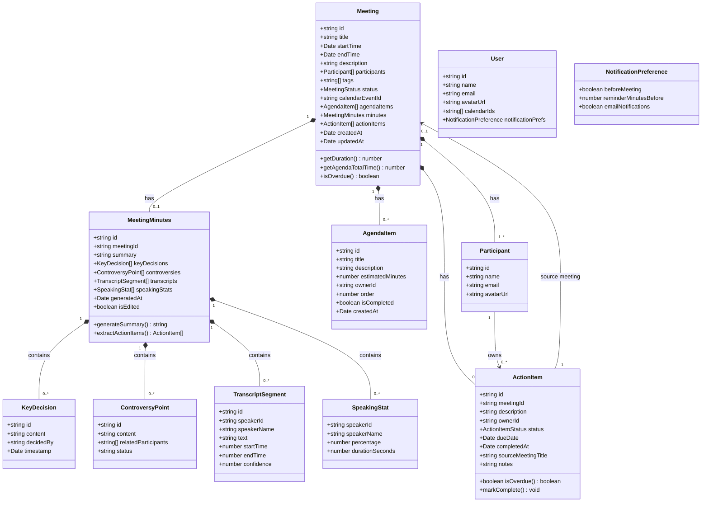
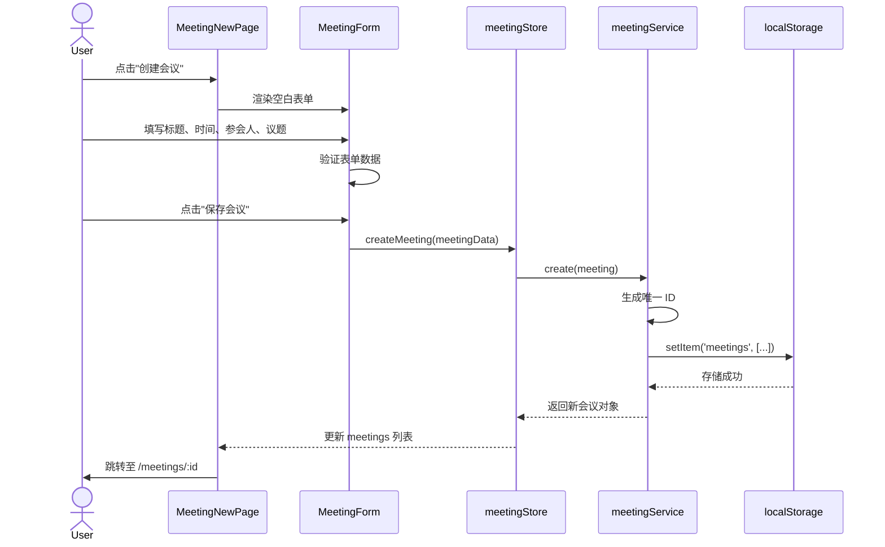
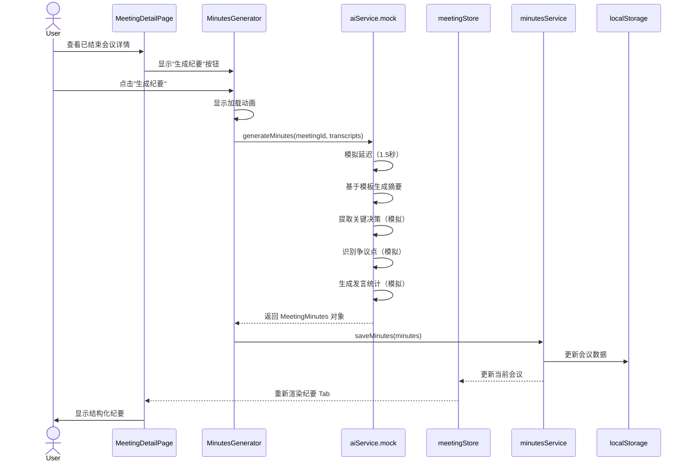
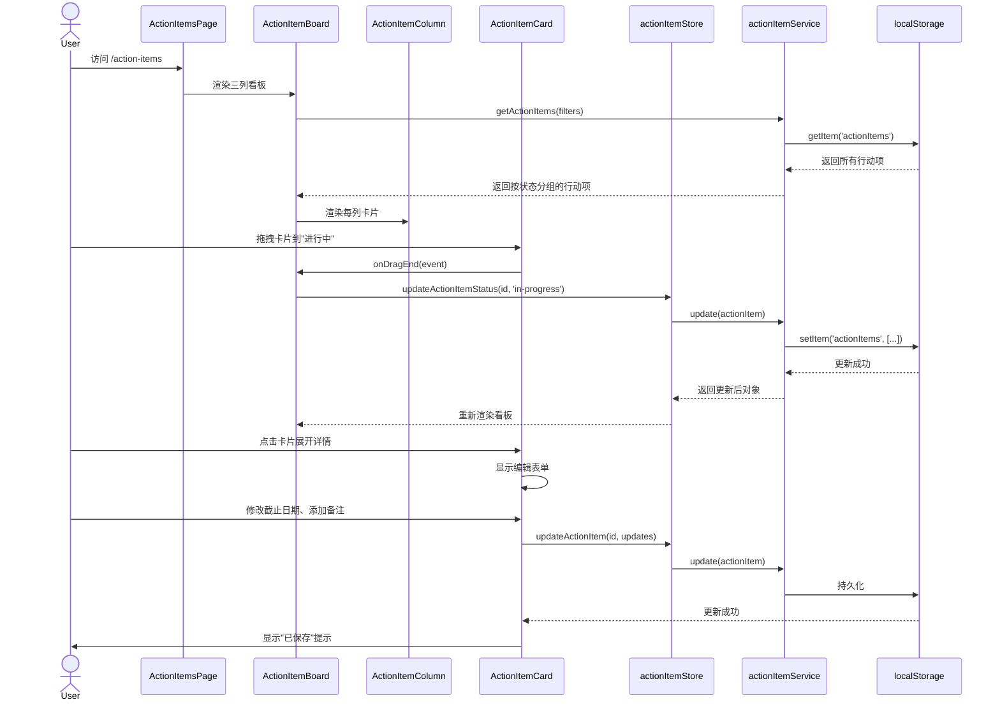
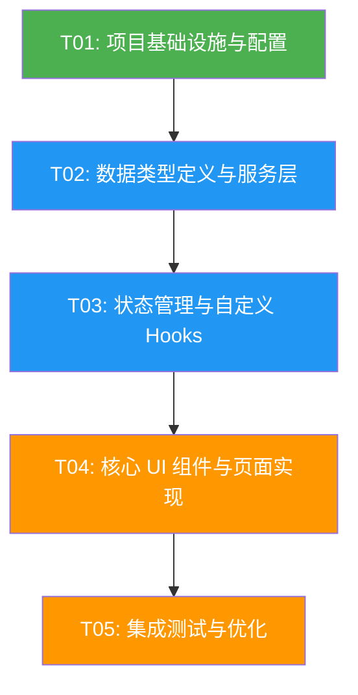

# MeetFlow 视频会议助手 - 系统架构设计文档

> **项目名称**: MeetFlow  
> **文档版本**: v1.0  
> **编写日期**: 2026-05-17  
> **编写人**: Bob（系统架构师）  
> **技术栈**: Vite + React + TypeScript + MUI + Tailwind CSS

---

## Part A: 系统设计

### 1. 实现方案

#### 1.1 技术选型与理由

| 技术/库 | 用途 | 选型理由 |
|---------|------|---------|
| **Vite** | 构建工具 | 快速 HMR、现代构建性能，开发体验优秀 |
| **React 18** | UI 框架 | 组件化开发，生态成熟 |
| **TypeScript** | 类型系统 | 类型安全，重构友好，适合中型项目 |
| **MUI (Material UI)** | 组件库 | 丰富的企业级组件，支持定制化主题 |
| **Tailwind CSS** | 样式方案 | 快速布局，响应式设计，与 MUI 互补 |
| **Zustand** | 状态管理 | 轻量级，API 简洁，适合 MVP 快速开发 |
| **React Router v6** | 路由管理 | 标准 React 路由方案，支持懒加载 |
| **localStorage** | 数据持久化 | MVP 阶段无需后端，快速实现数据持久化 |
| **@dnd-kit** | 拖拽功能 | 行动项看板拖拽排序，轻量且无障碍友好 |
| **date-fns** | 日期处理 | 轻量级日期库，模块化引入 |
| **react-hot-toast** | 消息提示 | 轻量级 toast 通知组件 |

#### 1.2 架构模式

采用 **Feature-based Architecture（按功能模块组织代码）**，结合自定义 Hooks 和 Service 层抽象：

- **表现层**: React 组件（pages + components）
- **状态层**: Zustand stores（按功能模块分离）
- **数据层**: Services（封装 localStorage 操作，未来可替换为 API 调用）
- **类型层**: TypeScript 类型定义（集中管理）

#### 1.3 核心设计决策

1. **localStorage 封装**: 创建统一的 StorageService，所有数据操作通过此服务，未来可无缝切换到 REST API 或 GraphQL
2. **Mock AI 功能**: 创建 AIService.mock.ts，使用预定义规则和模板数据模拟 AI 转写和纪要生成
3. **组件设计**: 采用 Composition Pattern，使用 MUI 的 `Paper`、`Card`、`Stack` 等基础组件组合，避免过度抽象
4. **响应式设计**: 使用 Tailwind 的响应式类 + MUI 的 Grid 系统，支持桌面端和平板端

---

### 2. 文件列表

```
src/
├── main.tsx                          # 应用入口
├── App.tsx                           # 根组件，路由配置
├── vite-env.d.ts                     # Vite 类型声明
│
├── types/                            # 类型定义
│   ├── index.ts                      # 统一导出
│   ├── meeting.ts                    # Meeting, MeetingStatus, MeetingTag
│   ├── agenda.ts                     # AgendaItem
│   ├── action-item.ts                # ActionItem, ActionItemStatus
│   ├── meeting-minutes.ts            # MeetingMinutes, KeyDecision, ControversyPoint
│   ├── user.ts                       # User, Participant
│   └── common.ts                     # ApiResponse, PaginatedResponse
│
├── constants/                        # 常量定义
│   ├── index.ts
│   ├── storage-keys.ts               # localStorage 键名常量
│   └── mock-data.ts                  # 初始 Mock 数据
│
├── services/                         # 数据服务层
│   ├── storage.service.ts            # localStorage 封装（CRUD 通用方法）
│   ├── meeting.service.ts            # 会议数据操作
│   ├── agenda.service.ts             # 议题数据操作
│   ├── action-item.service.ts        # 行动项数据操作
│   ├── minutes.service.ts            # 会议纪要数据操作
│   └── ai.service.mock.ts            # Mock AI 功能（转写 + 纪要生成）
│
├── hooks/                            # 自定义 Hooks
│   ├── useMeetings.ts                # 会议列表查询、筛选、搜索
│   ├── useMeeting.ts                 # 单个会议详情
│   ├── useActionItems.ts             # 行动项管理
│   ├── useAI.ts                      # AI 功能调用（模拟）
│   ├── useLocalStorage.ts            # localStorage 响应式 Hook
│   └── useToast.ts                   # Toast 消息提示封装
│
├── store/                            # Zustand 状态管理
│   ├── index.ts
│   ├── meeting.store.ts              # 会议状态
│   ├── action-item.store.ts          # 行动项状态
│   ├── ui.store.ts                   # UI 状态（侧边栏、主题等）
│   └── user.store.ts                 # 用户状态（模拟）
│
├── utils/                            # 工具函数
│   ├── index.ts
│   ├── date.ts                       # 日期格式化、计算
│   ├── id.ts                         # 生成唯一 ID（uuid 简化版）
│   ├── format.ts                     # 文本格式化（截断、高亮等）
│   └── export.ts                     # 导出功能（Markdown/PDF）
│
├── components/                       # 可复用组件
│   ├── layout/                       # 布局组件
│   │   ├── Header.tsx                # 顶部导航栏
│   │   ├── Sidebar.tsx               # 侧边栏（可选）
│   │   └── Layout.tsx                # 页面布局容器
│   │
│   ├── meeting/                      # 会议相关组件
│   │   ├── MeetingCard.tsx           # 会议卡片（列表页）
│   │   ├── MeetingForm.tsx           # 创建/编辑会议表单
│   │   ├── MeetingList.tsx            # 会议列表（带筛选）
│   │   ├── MeetingSearch.tsx          # 搜索栏
│   │   └── MeetingFilters.tsx        # 筛选器（状态、标签、日期）
│   │
│   ├── agenda/                       # 议题组件
│   │   ├── AgendaEditor.tsx          # 议题编辑器（主组件）
│   │   ├── AgendaItemCard.tsx        # 单个议题卡片（可拖拽）
│   │   ├── AgendaItemForm.tsx        # 议题编辑表单
│   │   └── AgendaTemplateSelector.tsx # 模板选择
│   │
│   ├── minutes/                      # 会议纪要组件
│   │   ├── MinutesViewer.tsx         # 纪要查看/编辑
│   │   ├── MinutesGenerator.tsx      # AI 生成纪要按钮 + 进度
│   │   ├── KeyDecisionsList.tsx      # 关键决策列表
│   │   ├── ControversyList.tsx       # 争议点列表
│   │   └── SpeakingStats.tsx         # 发言统计条形图
│   │
│   ├── action-item/                  # 行动项组件
│   │   ├── ActionItemBoard.tsx       # 看板容器（三列）
│   │   ├── ActionItemColumn.tsx      # 单列（待办/进行中/已完成）
│   │   ├── ActionItemCard.tsx        # 行动项卡片（可拖拽）
│   │   ├── ActionItemForm.tsx        # 新建/编辑行动项表单
│   │   └── ActionItemFilters.tsx     # 筛选器（会议、负责人）
│   │
│   ├── common/                       # 通用 UI 组件
│   │   ├── StatusBadge.tsx           # 状态标签（进行中/已结束）
│   │   ├── TagSelector.tsx           # 标签选择器
│   │   ├── ParticipantAvatar.tsx     # 参会人头像组
│   │   ├── EmptyState.tsx            # 空状态提示
│   │   ├── ConfirmDialog.tsx         # 确认对话框
│   │   └── PageHeader.tsx            # 页面标题 + 操作按钮
│   │
│   └── dashboard/                    # 仪表盘组件
│       ├── TodayOverview.tsx         # 今日概览卡片
│       ├── UpcomingMeeting.tsx       # 即将开始会议卡片
│       ├── MyActionItems.tsx         # 我的待办面板
│       └── RecentMeetings.tsx        # 最近会议列表
│
├── pages/                            # 页面组件
│   ├── DashboardPage.tsx             # 仪表盘 /
│   ├── MeetingsPage.tsx              # 会议列表 /meetings
│   ├── MeetingDetailPage.tsx          # 会议详情 /meetings/:id
│   ├── MeetingNewPage.tsx             # 创建会议 /meetings/new
│   ├── ActionItemsPage.tsx           # 行动项看板 /action-items
│   ├── TemplatesPage.tsx             # 模板库 /templates
│   └── SettingsPage.tsx              # 设置 /settings
│
├── styles/                           # 全局样式
│   ├── index.css                     # 全局 CSS + Tailwind 指令
│   ├── theme.ts                      # MUI 主题配置
│   └── tailwind.css                  # Tailwind 层（如果需要）
│
└── mock/                             # Mock 数据生成
    ├── meetings.ts                   # 模拟会议数据
    ├── minutes.ts                    # 模拟纪要数据
    └── action-items.ts               # 模拟行动项数据
```

---

### 3. 数据结构和接口



**类型定义补充说明**：

- `MeetingStatus`: `'scheduled' | 'in-progress' | 'completed'`
- `ActionItemStatus`: `'todo' | 'in-progress' | 'completed'`
- 所有 `id` 字段使用 `crypto.randomUUID()` 生成（浏览器原生 API）
- 日期字段统一使用 JavaScript `Date` 对象，存储时转为 ISO 字符串

---

### 4. 程序调用流程

#### 4.1 会议创建流程



#### 4.2 AI 纪要生成流程（模拟）



#### 4.3 行动项追踪流程



---

### 5. 不明确之处

1. **日历集成实现方式**：PRD 提到"支持 Google Calendar / Outlook Calendar"，但 MVP 使用 localStorage。建议 MVP 阶段仅支持手动创建会议，日历同步作为 P1 功能，在 `calendar.service.ts` 中预留接口。

2. **AI 转写模拟的具体规则**：当前设计使用预定义模板生成纪要。是否需要更精细的模拟（例如根据会议标题动态生成相关内容）？建议 V1 使用简单模板，后续迭代增强。

3. **多用户协作**：PRD 中 P1 有"纪要协作编辑"。MVP 使用 localStorage，无法实现实时协作。建议 MVP 仅支持单人编辑，协作功能在接入后端后实现。

4. **导出功能格式**：PRD 提到导出为 Markdown/PDF/飞书文档/Notion。MVP 建议先实现 Markdown 导出（纯前端生成 `.md` 文件），PDF 使用 `html2canvas` + `jsPDF`，飞书和 Notion 集成作为 P2。

5. **浏览器通知权限**：PRD 提到"会前提醒推送"。需要请求浏览器通知权限，建议 MVP 使用 `Notification API`，在设置页面引导用户开启。

---

## Part B: 任务分解

### 6. 依赖包列表

```txt
# 核心框架
react@^18.2.0
react-dom@^18.2.0
react-router-dom@^6.20.0
typescript@^5.2.2

# 构建工具
vite@^5.0.0
@vitejs/plugin-react@^4.2.0

# UI 框架
@mui/material@^5.14.0
@emotion/react@^11.11.0
@emotion/styled@^11.11.0
tailwindcss@^3.3.5
postcss@^8.4.31
autoprefixer@^10.4.16

# 状态管理
zustand@^4.4.7

# 拖拽功能
@dnd-kit/core@^6.1.0
@dnd-kit/sortable@^8.0.0
@dnd-kit/utilities@^3.2.2

# 工具库
date-fns@^3.0.6
react-hot-toast@^2.4.1
uuid@^9.0.0
@types/uuid@^9.0.7

# 导出功能
jspdf@^2.5.1
html2canvas@^1.4.1

# 开发依赖
@types/react@^18.2.43
@types/react-dom@^18.2.17
eslint@^8.55.0
eslint-plugin-react@^7.33.2
eslint-plugin-react-hooks@^4.6.0
prettier@^3.1.0
```

---

### 7. 任务列表（按依赖顺序排列）

#### T01: 项目基础设施与配置

**描述**: 搭建项目基础结构，配置开发环境，创建入口文件和全局样式。

**源文件**:
- `package.json`（项目依赖声明）
- `vite.config.ts`（Vite 构建配置）
- `tailwind.config.js`（Tailwind CSS 配置）
- `tsconfig.json`（TypeScript 配置）
- `index.html`（HTML 入口）
- `src/main.tsx`（React 入口）
- `src/App.tsx`（路由配置）
- `src/styles/index.css`（全局样式 + Tailwind 指令）
- `src/styles/theme.ts`（MUI 主题）
- `.eslintrc.cjs`（ESLint 配置）
- `.prettierrc`（Prettier 配置）

**依赖**: 无

**优先级**: P0

**验收标准**:
- `npm run dev` 成功启动开发服务器
- 浏览器显示 MeetFlow 标题
- MUI 主题和 Tailwind 样式正常加载

---

#### T02: 数据类型定义与服务层

**描述**: 定义所有 TypeScript 类型，实现 localStorage 封装和数据服务层，创建 Mock 数据。

**源文件**:
- `src/types/meeting.ts`
- `src/types/agenda.ts`
- `src/types/action-item.ts`
- `src/types/meeting-minutes.ts`
- `src/types/user.ts`
- `src/types/common.ts`
- `src/services/storage.service.ts`
- `src/services/meeting.service.ts`
- `src/services/agenda.service.ts`
- `src/services/action-item.service.ts`
- `src/services/minutes.service.ts`
- `src/services/ai.service.mock.ts`
- `src/constants/storage-keys.ts`
- `src/constants/mock-data.ts`
- `src/utils/id.ts`
- `src/utils/date.ts`

**依赖**: T01

**优先级**: P0

**验收标准**:
- 所有类型定义通过 TypeScript 编译
- `storage.service.ts` 提供 `getItem/setItem/removeItem` 通用方法
- `meeting.service.ts` 实现 CRUD 操作
- `ai.service.mock.ts` 能返回模拟的会议纪要数据
- Mock 数据能正确插入 localStorage

---

#### T03: 状态管理与自定义 Hooks

**描述**: 创建 Zustand stores 管理全局状态，实现自定义 Hooks 封装业务逻辑。

**源文件**:
- `src/store/meeting.store.ts`
- `src/store/action-item.store.ts`
- `src/store/ui.store.ts`
- `src/store/user.store.ts`
- `src/hooks/useMeetings.ts`
- `src/hooks/useMeeting.ts`
- `src/hooks/useActionItems.ts`
- `src/hooks/useAI.ts`
- `src/hooks/useLocalStorage.ts`
- `src/hooks/useToast.ts`

**依赖**: T02

**优先级**: P0

**验收标准**:
- Zustand stores 能正确管理状态
- `useMeetings` Hook 支持搜索和筛选
- `useAI` Hook 能调用 mock 服务并返回数据
- 状态更新能触发组件重新渲染

---

#### T04: 核心 UI 组件与页面实现

**描述**: 实现所有核心 UI 组件和页面，完成仪表盘、会议管理、行动项看板的主要功能。

**源文件**:
- `src/components/layout/Header.tsx`
- `src/components/layout/Layout.tsx`
- `src/components/dashboard/TodayOverview.tsx`
- `src/components/dashboard/UpcomingMeeting.tsx`
- `src/components/dashboard/MyActionItems.tsx`
- `src/components/meeting/MeetingCard.tsx`
- `src/components/meeting/MeetingForm.tsx`
- `src/components/meeting/MeetingList.tsx`
- `src/components/meeting/MeetingSearch.tsx`
- `src/components/agenda/AgendaEditor.tsx`
- `src/components/agenda/AgendaItemCard.tsx`
- `src/components/minutes/MinutesViewer.tsx`
- `src/components/minutes/MinutesGenerator.tsx`
- `src/components/action-item/ActionItemBoard.tsx`
- `src/components/action-item/ActionItemCard.tsx`
- `src/components/action-item/ActionItemForm.tsx`
- `src/components/common/StatusBadge.tsx`
- `src/components/common/EmptyState.tsx`
- `src/pages/DashboardPage.tsx`
- `src/pages/MeetingsPage.tsx`
- `src/pages/MeetingDetailPage.tsx`
- `src/pages/MeetingNewPage.tsx`
- `src/pages/ActionItemsPage.tsx`

**依赖**: T03

**优先级**: P0

**验收标准**:
- 仪表盘显示今日会议概览和待办统计
- 会议列表支持搜索和筛选
- 创建会议表单能成功保存数据
- 会议详情页能切换"议程/纪要/行动项" Tab
- 行动项看板支持拖拽排序（三列流转）
- AI 纪要生成按钮能模拟生成结构化纪要

---

#### T05: 集成测试与优化

**描述**: 完成剩余页面（模板库、设置），实现导出功能，进行全流程测试和优化。

**源文件**:
- `src/pages/TemplatesPage.tsx`
- `src/pages/SettingsPage.tsx`
- `src/components/agenda/AgendaTemplateSelector.tsx`
- `src/components/minutes/SpeakingStats.tsx`
- `src/components/action-item/ActionItemFilters.tsx`
- `src/components/common/ConfirmDialog.tsx`
- `src/utils/export.ts`
- `src/utils/format.ts`

**依赖**: T04

**优先级**: P1

**验收标准**:
- 模板库页面能浏览和套用模板
- 设置页面能配置通知偏好
- 纪要页面能导出为 Markdown 和 PDF
- 所有 P0 功能全流程打通
- UI 还原度达到 PRD 设计稿的 90% 以上
- 无 TypeScript 类型错误和控制台报错

---

### 8. 共享知识（跨文件约定）

#### 8.1 命名规范

- **文件/组件**: PascalCase（如 `MeetingCard.tsx`、`useMeetings.ts`）
- **函数/变量**: camelCase（如 `getMeetings`、`handleSubmit`）
- **常量**: UPPER_SNAKE_CASE（如 `STORAGE_KEYS`、`API_ENDPOINTS`）
- **类型/接口**: PascalCase，接口不加 `I` 前缀（如 `Meeting`、`ActionItemStatus`）
- **CSS 类**: Tailwind 实用类优先，自定义类使用 kebab-case

#### 8.2 代码风格约定

- 使用 Prettier 自动格式化（120 字符换行，单引号，无分号）
- 使用 ESLint 强制 React Hooks 规则和 TypeScript 最佳实践
- 组件使用函数式组件 + Hooks，不使用 class 组件
- 优先使用 `interface` 定义对象类型，仅在需要联合类型时使用 `type`
- 所有组件 props 定义接口，命名为 `{ComponentName}Props`

#### 8.3 组件设计模式

- **容器/展示模式**: 页面组件（`pages/`）负责数据获取，子组件负责渲染
- **复合组件**: 使用 MUI 的 `Popover`、`Dialog` 等组件时，将触发器和内容分离
- **Render Props / Children**: 需要高度定制的组件使用 `children` 或 render prop
- **Hook 封装**: 数据获取、表单处理等逻辑抽离到自定义 Hooks

#### 8.4 数据层抽象

- 所有数据操作通过 `services/` 层，组件不允许直接访问 localStorage
- Service 方法返回 Promise，即使当前是同步操作（为未来对接 API 做准备）
- 错误处理：Service 层抛出自定义错误，Hook 层捕获并显示 toast

#### 8.5 Mock AI 功能约定

- `ai.service.mock.ts` 使用确定性算法（基于 meetingId 的 hash）生成可重复的模拟数据
- 模拟延迟使用 `setTimeout` 包装，返回 Promise
- 生成的纪要内容从 `constants/mock-data.ts` 的模板中随机选择

---

### 9. 任务依赖图



**说明**:
- T01 是基础设施，必须最先完成
- T02 和 T03 可以部分并行（类型定义完成后即可开始实现 Store）
- T04 依赖 T03 的 Hooks 完成，但部分展示组件可以在类型定义完成后开始
- T05 是收尾工作，依赖所有功能组件完成

---

## 附录：关键技术实现细节

### A. localStorage 封装示例

```typescript
// services/storage.service.ts
export const storageService = {
  getItem<T>(key: string): T | null {
    const raw = localStorage.getItem(key);
    return raw ? JSON.parse(raw) : null;
  },

  setItem<T>(key: string, value: T): void {
    localStorage.setItem(key, JSON.stringify(value));
  },

  removeItem(key: string): void {
    localStorage.removeItem(key);
  },

  // 生成唯一键名（添加前缀避免冲突）
  withPrefix(key: string): string {
    return `meetflow_${key}`;
  }
};
```

### B. Zustand Store 示例

```typescript
// store/meeting.store.ts
import { create } from 'zustand';
import { Meeting } from '@/types';

interface MeetingStore {
  meetings: Meeting[];
  currentMeeting: Meeting | null;
  isLoading: boolean;
  
  fetchMeetings: () => Promise<void>;
  getMeetingById: (id: string) => Meeting | undefined;
  createMeeting: (meeting: Omit<Meeting, 'id'>) => Promise<Meeting>;
  updateMeeting: (id: string, updates: Partial<Meeting>) => Promise<void>;
  deleteMeeting: (id: string) => Promise<void>;
}

export const useMeetingStore = create<MeetingStore>((set, get) => ({
  meetings: [],
  currentMeeting: null,
  isLoading: false,

  fetchMeetings: async () => {
    set({ isLoading: true });
    const meetings = await meetingService.getAll();
    set({ meetings, isLoading: false });
  },

  // ... 其他方法实现
}));
```

### C. Mock AI 服务示例

```typescript
// services/ai.service.mock.ts
export const aiService = {
  async generateMinutes(meetingId: string): Promise<MeetingMinutes> {
    // 模拟延迟
    await new Promise(resolve => setTimeout(resolve, 1500));

    // 基于 meetingId 生成确定性 Mock 数据
    const hash = meetingId.split('').reduce((acc, char) => acc + char.charCodeAt(0), 0);
    const templateIndex = hash % MOCK_MINUTES_TEMPLATES.length;

    return {
      id: crypto.randomUUID(),
      meetingId,
      summary: MOCK_MINUTES_TEMPLATES[templateIndex].summary,
      keyDecisions: MOCK_MINUTES_TEMPLATES[templateIndex].decisions,
      controversies: MOCK_MINUTES_TEMPLATES[templateIndex].controversies,
      generatedAt: new Date(),
      isEdited: false
    };
  }
};
```

---

**文档结束**

> 本设计文档涵盖了 MeetFlow MVP 所需的所有技术决策、文件结构、数据类型、流程设计和任务分解。所有设计均考虑未来扩展性（如从 localStorage 迁移到后端 API），同时保证 MVP 阶段能快速开发和演示。
